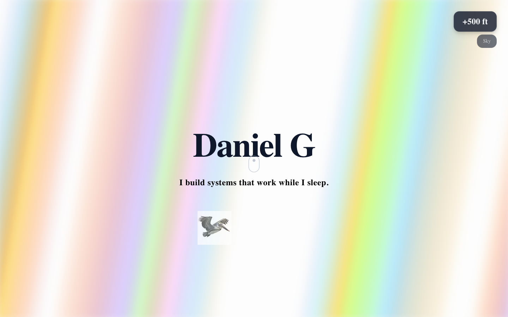
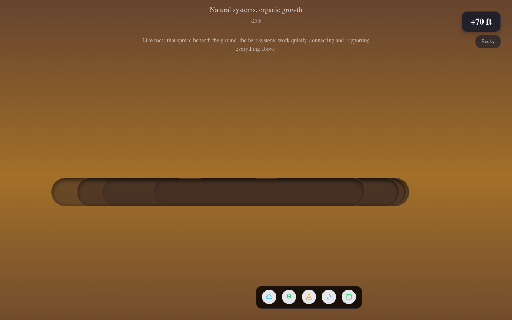

# Iteration V1 - Issues Identified

**Date:** Feb 4, 2026
**Branch:** `iteration/v1-aceternity-components`

---

## 1. Hero Section (Critical)

**Problems:**
- Aurora effect creates vertical stripe gradients - looks like a test pattern, not clouds
- No sense of being "in the sky" or atmospheric depth
- Pelican is tiny and on white background square (doesn't blend)
- Text is dark on light background - low contrast, hard to read
- Overall feels like a placeholder, not a hero

**Needs:**
- Cloud imagery or atmospheric sky background
- Prompt for AI-generated hero background matching Big Sur aesthetic
- Pelican should blend into scene, not float on white card

---

## 2. Altitude Meter Mismatch (Major)

**Observed in screenshots:**
- Forest section shows "+392 ft" and "Sky" label
- Underground Roots shows "+70 ft" and "Rocky" label
- Burrows shows "-38 ft" and "Burrows" label
- Datacenter area shows "-100 ft" but page is mostly brown gradient

**Problems:**
- Altitude indicator is NOT synced with actual scroll position
- Zone labels don't match current visible section
- The meter seems to be reading from old zone system, not new StorySection

**Needs:**
- Refactor AltitudeMeter to work with new page structure
- Sync with actual sections: Hero → Story (Forest/Rocky/Coastal) → Datacenter

---

## 3. Legacy Sections (Remove/Replace)

Three sections after "Automation Obsession" (Coastal) are legacy:

### 3a. Underground Roots

- Brown gradient with pill-shaped tunnel graphics
- Content: "Natural systems, organic growth" - doesn't fit new narrative
- No background image - just CSS gradient

### 3b. Underground Burrows

- Similar brown gradient, slightly different shade
- Content: "These aren't random. Someone's been working down here..."
- Hard transition line visible between sections

### 3c. Datacenter Transition Area

- Shows "-100 ft Datacenter" but just brown/orange gradient
- No actual datacenter background visible
- Green particles floating on gradient (not on datacenter image)

**Problems:**
- These were part of old "descent" narrative that's been replaced
- Visual style (CSS gradients) doesn't match new image-based sections
- Breaks the flow from Coastal → Datacenter
- The actual datacenter with groundhogs isn't showing in scroll

**Needs:**
- Remove Underground Roots and Underground Burrows entirely
- Direct transition from Coastal story section to Datacenter
- Generate matching transition background or fade effect

---

## 4. Story Section - What Works

**Working well:**
- Forest background is beautiful and immersive
- Glass card with text is readable
- Wildlife images (jay, slug) add character
- Section indicator dots on right side

**Minor issues:**
- Wildlife images have white/light backgrounds (should be transparent or blend)
- Card positioning could be refined

---

## 5. Transitions

**Problems observed:**
- Hard line visible between Burrows and next section
- No smooth blend between Story sections and legacy sections
- Gradient sections feel disconnected from image-based sections

---

## 6. Assets Needed (Prompts Required)

### Hero Background
Need AI-generated image:
- Big Sur style clouds/sky
- California sunset colors (gold, coral, purple, blue)
- Atmospheric, dreamy, "in the clouds" feeling
- Pelican could be silhouette in scene

### Transition Background (optional)
If keeping any underground concept:
- Should match the painterly/photographic style of Forest/Rocky/Coastal
- Not CSS gradients

---

## Summary: What to Keep vs Remove

### Keep
- StorySection (Forest, Rocky, Coastal with sticky scroll)
- Datacenter section concept (but fix visibility)
- Terminal contact form
- Floating dock navigation
- Mobile landscape prompt
- Border Beam, Particles effects

### Remove/Replace
- Current Aurora Background implementation
- Underground Roots zone
- Underground Burrows zone
- Current AltitudeMeter (needs rewrite)

### Generate New Assets
- Hero/Sky background image
- Possibly pelican integrated into scene
